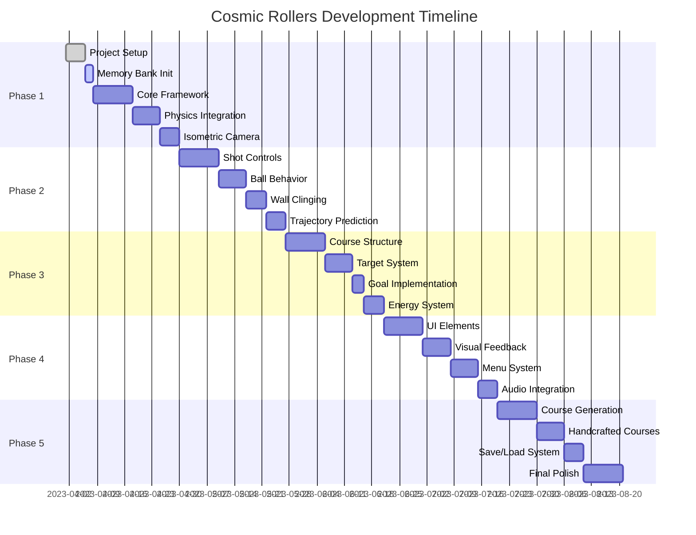

<<<<<<< HEAD
# Progress: Cosmic Rollers

## Current Project Status: Core Implementation

This project is currently in the implementation phase of core game mechanics. We have established the foundational architecture and are working on the gameplay systems, with a focus on shot mechanics.

## Development Progress Timeline

| Phase | Status | Completion |
|-------|--------|------------|
| Project Planning | Completed | 100% |
| Core Architecture | Completed | 90% |
| Core Mechanics | In Progress | 60% |
| Core Gameplay | In Progress | 30% |
| Procedural Generation | Not Started | 0% |
| Polish & Refinement | Not Started | 0% |
| Overall Project | In Progress | 40% |

## What's Working

- ✅ Project architecture and foundation
- ✅ Three.js integration with scene, camera, and renderer
- ✅ Rapier physics integration with world setup
- ✅ Game loop implementation
- ✅ Entity system with ball and terrain
- ✅ Physics synchronization between visual and physics objects
- ✅ Singleton pattern implementation for core managers
- ✅ Camera controller with isometric view
- ✅ Basic shot firing mechanism via UI
- ✅ Game state management system

## What's In Progress

- 🔄 Shot control system
- 🔄 Aiming mechanism (currently not working correctly)
- 🔄 Input handling for keyboard/mouse controls
- 🔄 Camera following behavior
- 🔄 Collision response and physics tuning
- 🔄 UI feedback during shot execution

## What's Next (Upcoming Tasks)

1. Debug and fix the aiming functionality
2. Implement proper input handling for aim direction
3. Enhance the aim arrow visualization
4. Refine the shot power mechanics
5. Add spin controls to shots
6. Implement different shot types (grounder vs. fly)
7. Create more complex terrain with different surfaces

## Known Issues & Blockers

- 🐛 **Shot Aiming Not Working**: The aiming function isn't working correctly. UI button for shooting works, but aiming direction control is not functioning.
- 🐛 Need proper input handling for keyboard/mouse controls
- 🐛 Aim arrow visualization may not be updating properly
- 🐛 Potential issues with state transitions during aiming process

## Technical Debt

- Cleanup of temp code used during prototyping
- Need more robust error handling for physics initialization
- Input system needs abstraction layer for better maintainability

## Feature Status

### Core Mechanics

| Feature | Status | Notes |
|---------|--------|-------|
| Three.js Setup | Completed | Basic scene, camera, and renderer implemented |
| Rapier Physics Setup | Completed | Physics world initialization working |
| Ball Physics | Completed | Ball entity with rigid body implemented |
| Basic Terrain | Completed | Simple terrain with collision working |
| Isometric Camera | In Progress | Basic camera implemented, needs refinement |

### Shot Mechanics

| Feature | Status | Notes |
|---------|--------|-------|
| Aiming System | In Progress | **Not working correctly**, needs debugging |
| Power Meter | Completed | UI element and power selection working |
| Shot Execution | Completed | Basic shot firing mechanism working |
| Shot Types | Not Started | Grounder vs. fly shot mechanics planned |
| Spin Controls | Not Started | Adding spin to shots planned |

### Procedural Generation

| Feature | Status | Notes |
|---------|--------|-------|
| Noise Generator | Not Started | Simplex noise implementation planned |
| Terrain Generator | Not Started | Creating terrain from noise planned |
| Object Placement | Not Started | Placing targets and obstacles planned |
| Course Validation | Not Started | Ensuring courses are playable planned |

### Gameplay Systems

| Feature | Status | Notes |
|---------|--------|-------|
| Targets | Not Started | Entities that react to collision |
| Obstacles | Not Started | Static and dynamic obstacles |
| Score Tracking | Not Started | Tracking shots and completion |
| Win Conditions | Not Started | Level completion logic |

## Development Metrics

| Metric | Target | Current |
|--------|--------|---------|
| FPS | 60 | ~60 (needs optimization) |
| Load Time | <5s | ~3s (initial load) |
| Build Size | <5MB | ~2MB (current build) |
| Physics Bodies | <100 | 2 (ball and terrain) |
| Draw Calls | <50 | ~10 (current scene) |

## Lessons Learned So Far

- Async initialization of Rapier WASM requires careful handling
- Singleton pattern is effective for manager classes but needs proper implementation
- Three.js and Rapier integration works well but requires manual synchronization
- Game state management is crucial for coordinating complex interactions
- UI integration needs close coordination with core game mechanics
- Proper error handling is essential for debugging physics issues

## Immediate Focus

- Debug the shot aiming functionality to understand why direction control isn't working
- Examine the input handling code in ShotController
- Review the arrow visualization implementation
- Test state transitions during the aiming process
- Ensure proper coordination between game states and shot mechanics

## Risk Assessment

| Risk | Likelihood | Impact | Mitigation |
|------|------------|--------|------------|
| Shot mechanics feel unsatisfying | Medium | High | Iterative refinement, adjustable parameters |
| Physics glitches with complex terrain | High | Medium | Thorough testing, collision refinement |
| Performance issues with many entities | Medium | Medium | Optimization, object pooling |
| Camera issues with complex courses | Medium | Medium | Multiple camera modes, testing |
| Browser compatibility | Low | Medium | Target modern browsers, feature detection | 
=======
# Progress Tracker

## Project Status: Initialization Phase

## What Works
- Memory Bank documentation initialized
- Project requirements documented 
- Architecture and technical decisions established

## In Progress
- Project scaffolding setup
- Technology selection and integration planning
- Development environment configuration

## Key Milestone Progress
| Milestone | Status | Est. Completion |
|-----------|--------|-----------------|
| Memory Bank Setup | 🟢 Complete | 2023-04-07 |
| Project Scaffolding | 🟡 In Progress | 2023-04-10 |
| Basic Rendering | ⚪ Not Started | 2023-04-15 |
| Physics Setup | ⚪ Not Started | 2023-04-22 |
| Ball Controls | ⚪ Not Started | 2023-05-05 |
| First Playable | ⚪ Not Started | 2023-05-15 |

## What's Left to Build
1. **Phase 1: Core Framework & Physics**
   - Project scaffolding
   - Three.js integration
   - Rapier physics setup
   - Basic terrain rendering
   - Isometric camera implementation
   - Player ball with physics properties
   
2. **Phase 2: Movement Controls & Ball Behavior**
   - Shot control system
   - Wall-clinging physics
   - In-flight bounce mechanics
   - Trajectory prediction
   - Collision feedback
   
3. **Phase 3: Gameplay Elements & Course Structure**
   - Course with different surface types
   - Target system
   - Goal hole mechanics
   - Energy system
   - Game state management
   
4. **Phase 4: Game UI & Visual Feedback**
   - Power meter and aim indicators
   - Game HUD
   - Visual effects for actions
   - Win/lose screens
   - Sound effects
   
5. **Phase 5: Course Creation & Testing**
   - Procedural generation
   - Handcrafted courses
   - Save/load functionality
   - Game flow polish

## Known Issues
- No active issues - project in initialization phase

## Next Release Target
- **Alpha Version**: Basic physics and ball control with simple terrain (Target: 2023-05-15)
- **Beta Version**: Full gameplay with targets and goals (Target: 2023-06-15)
- **Initial Release**: Complete game with courses and UI (Target: 2023-07-15) 
>>>>>>> 5080cde72b173858c5d2a159c5d70f021895bc1b
