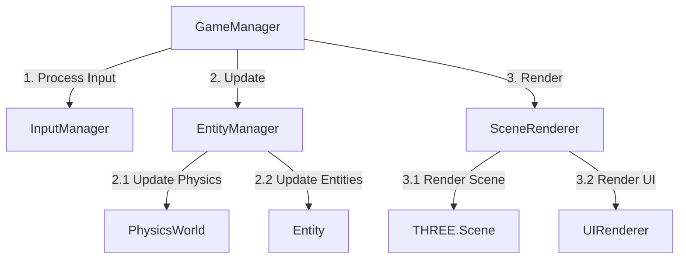
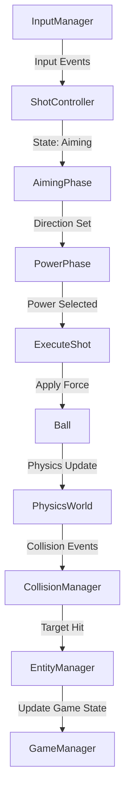
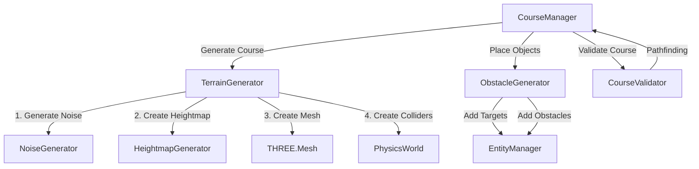
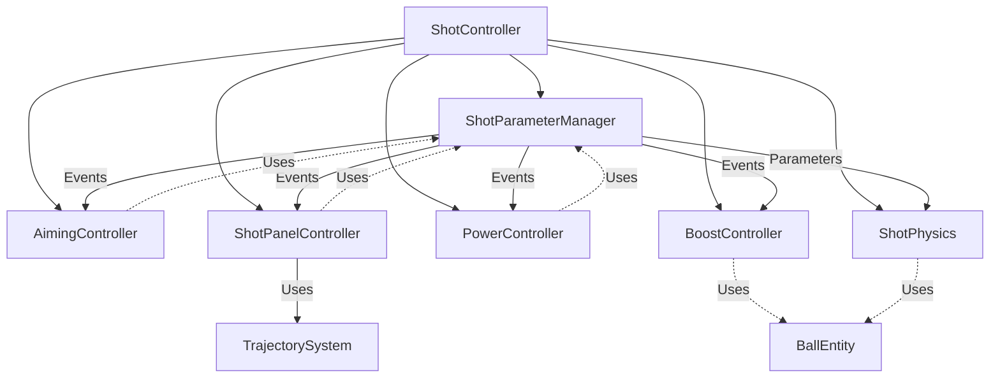
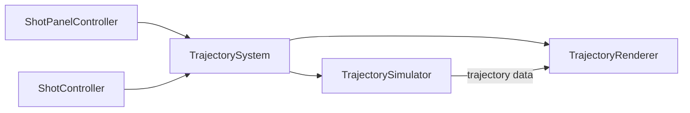

# System Patterns: Cosmic Rollers

## Architecture Overview

### High-Level Architecture
Cosmic Rollers employs a modular architecture with clear separation between game systems:

```
Game
├── Core
│   ├── GameManager: Central controller for game state and systems
│   ├── AssetManager: Handles resource loading and caching
│   ├── InputManager: Processes and normalizes player input
│   └── SceneManager: Controls level loading and transitions
├── Physics
│   ├── PhysicsWorld: Encapsulates Rapier world and parameters
│   ├── CollisionManager: Handles collision callbacks and events
│   └── PhysicsDebugger: Visual debugging for physics bodies
├── Rendering
│   ├── SceneRenderer: Main Three.js scene handling
│   ├── CameraController: Manages isometric camera behavior
│   ├── EffectsManager: Particle systems and visual feedback
│   └── UIRenderer: Handles in-game interface elements
├── Gameplay
│   ├── ShotController: Implements shot mechanics and power system
│   ├── CourseManager: Loads/generates and tracks course state
│   ├── EntityManager: Tracks all game objects and their states
│   └── ScoreManager: Tracks player progress and statistics
└── Procedural
    ├── NoiseGenerator: Perlin/Simplex noise generation
    ├── TerrainGenerator: Creates course terrain from noise maps
    ├── ObstacleGenerator: Places obstacles based on terrain
    └── CourseValidator: Ensures generated courses are playable
```

### Entity Hierarchy
The game uses an entity-based system with inheritance for shared behaviors:

```
Entity (Base class with position, rotation, update method)
├── Ball: Player-controlled ball with physics properties
├── Terrain: Course surfaces with collision
│   ├── FlatTerrain: Basic flat surfaces
│   ├── SlopedTerrain: Inclined surfaces affecting ball physics
│   └── HazardTerrain: Special areas like water or sand
├── Target: Enemies/objects that react to ball collision
│   ├── BasicTarget: Simple target that disappears on hit
│   ├── MovingTarget: Target that follows a predetermined path
│   └── BossTarget: Special target requiring multiple hits
├── Obstacle: Objects affecting ball movement
│   ├── Wall: Blocks ball movement
│   ├── Bumper: Bounces the ball with increased restitution
│   └── Booster: Provides additional momentum in a direction
└── Goal: Final target that completes the level
```

## Key Design Patterns

### Singleton Pattern
Used for manager classes that need global access with a single instance:
- GameManager
- PhysicsWorld
- SceneRenderer
- InputManager

### Observer Pattern
Used for event handling and communication between decoupled systems:
- Game events (shot taken, target hit, level complete)
- Physics callbacks (collision events, sleep events)
- Input events (button press, touch events)

### Command Pattern
Used for input handling and action execution:
- ShotController actions (aim, power, execute)
- Camera controls (zoom, rotate, follow)
- UI interactions (button presses, menu navigation)

### Factory Pattern
Used for creating game entities dynamically:
- EntityFactory for creating game objects
- TerrainFactory for generating different terrain types
- ObstacleFactory for creating obstacles

### State Pattern
Used for managing different game states:
- GameStates (menu, play, pause, game over)
- ShotStates (aiming, power selection, ball in motion)
- CameraStates (follow player, free look, transition)

## Component Relationships

### Core Game Loop


### Shot System Flow


### Procedural Generation Pipeline


## Key Technical Decisions

### Physics System
- Using Rapier.js for high-performance physics
- Fixed timestep for consistent physics simulation
- Custom physics properties for ball (mass, restitution, friction)
- Collision filtering for specific interaction rules

### Rendering Approach
- Three.js as the primary rendering engine
- Fixed isometric camera with dynamic follow behavior
- Instanced rendering for repeated elements
- Shader-based effects for visual polish

### Procedural Generation Strategy
- Multi-octave Simplex noise for natural terrain
- Constraint-based placement for obstacles and targets
- Pathfinding validation to ensure course playability
- Parameter-driven generation for different difficulty levels

### State Management
- Clear game state transitions
- Observable properties for reactive UI updates
- Persistent storage for game progress and settings
- Reset mechanisms for level restart

## Component-Based Shot System Architecture

After significant refactoring, we've implemented a component-based architecture for the shot system, breaking down the monolithic ShotController into specialized components with clear responsibilities:



### Component Responsibilities

1. **ShotController**: Serves as a facade for the entire shot system, coordinating the different phase controllers and handling overall state transitions.

2. **ShotParameterManager**: Central store for all shot parameters (angle, power, shot type, spin type, etc.), providing a single source of truth and notifying other components of parameter changes through events.

3. **AimingController**: Handles Phase 1 (Direction Selection), including the aim arrow visualization and direction input processing.

4. **ShotPanelController**: Handles Phase 2 (Guide Length Selection), managing the UI for guide length toggling and coordinating with the trajectory system.

5. **PowerController**: Handles Phase 3 (Power and Spin Selection), including the oscillating power meter and spin input processing.

6. **BoostController**: Handles Phase 4 (Shot Execution and Boost), detecting bounce opportunities and applying boost forces when activated.

7. **ShotPhysics**: Encapsulates physics calculations for different shot types, applying appropriate forces and spin effects.

### Communication Patterns

- **Parameter Changes**: Components update parameters through the ShotParameterManager, which then emits events to notify other components.
- **State Transitions**: The ShotController observes game state changes and delegates to the appropriate phase controller.
- **Event-Based Coordination**: Components communicate primarily through the EventSystem, reducing direct coupling.
- **Facade Pattern**: ShotController presents a simplified interface to the rest of the game while delegating to specialized components.

## Refactored Trajectory System

The trajectory system has been refactored into a clear separation between simulation and visualization:



### Component Responsibilities

1. **TrajectorySystem**: Serves as a facade, coordinating between simulation and rendering components.

2. **TrajectorySimulator**: Handles the physics calculations to predict the ball's trajectory based on shot parameters, generating points and bounce locations.

3. **TrajectoryRenderer**: Manages the visual representation of the trajectory, including the line, bounce indicators, and landing indicators.

### Benefits of the New Architecture

- **Separation of Concerns**: Clear separation between physics simulation and visual rendering
- **Improved Testability**: Each component can be tested in isolation
- **Better Maintainability**: Changes to one aspect (e.g., physics) don't affect other aspects (e.g., visualization)
- **Enhanced Performance**: More efficient updates by only recalculating what's necessary
- **Clearer Data Flow**: Well-defined interfaces between components
