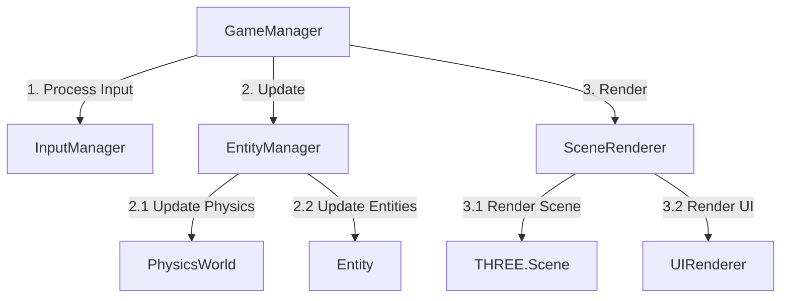
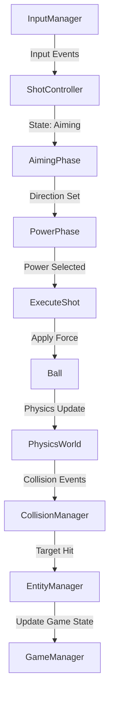
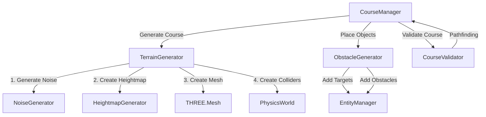
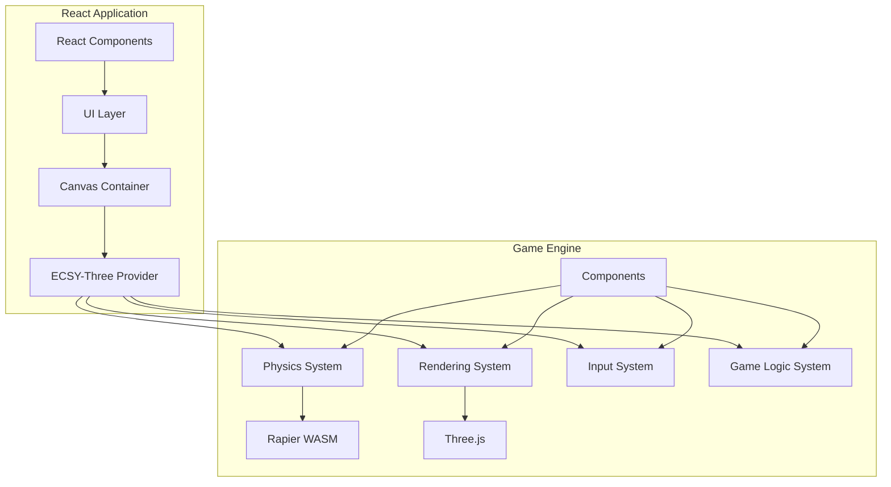

<<<<<<< HEAD
# System Patterns: Cosmic Rollers

## Architecture Overview

### High-Level Architecture
Cosmic Rollers employs a modular architecture with clear separation between game systems:

```
Game
├── Core
│   ├── GameManager: Central controller for game state and systems
│   ├── AssetManager: Handles resource loading and caching
│   ├── InputManager: Processes and normalizes player input
│   └── SceneManager: Controls level loading and transitions
├── Physics
│   ├── PhysicsWorld: Encapsulates Rapier world and parameters
│   ├── CollisionManager: Handles collision callbacks and events
│   └── PhysicsDebugger: Visual debugging for physics bodies
├── Rendering
│   ├── SceneRenderer: Main Three.js scene handling
│   ├── CameraController: Manages isometric camera behavior
│   ├── EffectsManager: Particle systems and visual feedback
│   └── UIRenderer: Handles in-game interface elements
├── Gameplay
│   ├── ShotController: Implements shot mechanics and power system
│   ├── CourseManager: Loads/generates and tracks course state
│   ├── EntityManager: Tracks all game objects and their states
│   └── ScoreManager: Tracks player progress and statistics
└── Procedural
    ├── NoiseGenerator: Perlin/Simplex noise generation
    ├── TerrainGenerator: Creates course terrain from noise maps
    ├── ObstacleGenerator: Places obstacles based on terrain
    └── CourseValidator: Ensures generated courses are playable
```

### Entity Hierarchy
The game uses an entity-based system with inheritance for shared behaviors:

```
Entity (Base class with position, rotation, update method)
├── Ball: Player-controlled ball with physics properties
├── Terrain: Course surfaces with collision
│   ├── FlatTerrain: Basic flat surfaces
│   ├── SlopedTerrain: Inclined surfaces affecting ball physics
│   └── HazardTerrain: Special areas like water or sand
├── Target: Enemies/objects that react to ball collision
│   ├── BasicTarget: Simple target that disappears on hit
│   ├── MovingTarget: Target that follows a predetermined path
│   └── BossTarget: Special target requiring multiple hits
├── Obstacle: Objects affecting ball movement
│   ├── Wall: Blocks ball movement
│   ├── Bumper: Bounces the ball with increased restitution
│   └── Booster: Provides additional momentum in a direction
└── Goal: Final target that completes the level
```

## Key Design Patterns

### Singleton Pattern
Used for manager classes that need global access with a single instance:
- GameManager
- PhysicsWorld
- SceneRenderer
- InputManager

### Observer Pattern
Used for event handling and communication between decoupled systems:
- Game events (shot taken, target hit, level complete)
- Physics callbacks (collision events, sleep events)
- Input events (button press, touch events)

### Command Pattern
Used for input handling and action execution:
- ShotController actions (aim, power, execute)
- Camera controls (zoom, rotate, follow)
- UI interactions (button presses, menu navigation)

### Factory Pattern
Used for creating game entities dynamically:
- EntityFactory for creating game objects
- TerrainFactory for generating different terrain types
- ObstacleFactory for creating obstacles

### State Pattern
Used for managing different game states:
- GameStates (menu, play, pause, game over)
- ShotStates (aiming, power selection, ball in motion)
- CameraStates (follow player, free look, transition)

## Component Relationships

### Core Game Loop


### Shot System Flow


### Procedural Generation Pipeline


## Key Technical Decisions

### Physics System
- Using Rapier.js for high-performance physics
- Fixed timestep for consistent physics simulation
- Custom physics properties for ball (mass, restitution, friction)
- Collision filtering for specific interaction rules

### Rendering Approach
- Three.js as the primary rendering engine
- Fixed isometric camera with dynamic follow behavior
- Instanced rendering for repeated elements
- Shader-based effects for visual polish

### Procedural Generation Strategy
- Multi-octave Simplex noise for natural terrain
- Constraint-based placement for obstacles and targets
- Pathfinding validation to ensure course playability
- Parameter-driven generation for different difficulty levels

### State Management
- Clear game state transitions
- Observable properties for reactive UI updates
- Persistent storage for game progress and settings
- Reset mechanisms for level restart 
=======
# System Patterns

## Architecture Overview
Cosmic Rollers uses an Entity Component System (ECS) architecture with ECSY as the framework, providing a clean separation of concerns and improved performance for a physics-based game.



## Core Design Patterns

### Entity Component System (ECS)
- **Entities**: Game objects (ball, targets, terrain)
- **Components**: Data containers (transform, physics, rendering)
- **Systems**: Logic that processes entities with relevant components

### Provider Pattern
- ECSY-Three world provided through React context
- Systems access shared world instance through hooks
- Clean mounting/unmounting of 3D resources

### State Machine Pattern
- Game states (IDLE, AIMING, POWER, SHOT, ROLLING)
- Input handlers change based on current state
- Clear transitions between states

### Event System
- Observer pattern for game events
- Components subscribe to relevant events
- Decouples systems for better testability

## Code Organization

```
src/
├── components/         # React UI components
│   ├── game/           # Game-specific UI
│   ├── menu/           # Menu screens
│   └── ui/             # Reusable UI elements
├── core/               # Core game systems
│   ├── ecs/            # ECS setup and configuration
│   ├── physics/        # Physics integration
│   ├── rendering/      # Three.js integration
│   └── state/          # Game state management
├── entities/           # Entity factories
├── systems/            # ECS systems
├── components/         # ECS components
├── utils/              # Utility functions
└── assets/             # Game assets
```

## Component Structure Guidelines
- Each component should focus on a single responsibility
- Maximum file size: 300-500 lines of code
- Components should be independent and reusable where possible
- Use composition over inheritance

## Key Technical Decisions

### Three.js Integration
- Use ECSY-Three for seamless ECS-Three.js integration
- OrthographicCamera for isometric view
- Consistent scene graph organization

### Physics Implementation
- Rapier WASM for high-performance physics
- Custom physics components for specialized behaviors
- Collision groups for proper interaction filtering

### Shot System
- State-based implementation with clear phases
- Predictive trajectory visualization
- Separate input handling by state

### React Integration
- React for UI only, not game logic
- Canvas managed by React for lifecycle control
- Event-based communication between UI and game systems 
>>>>>>> 5080cde72b173858c5d2a159c5d70f021895bc1b
